# Demo Overview

The purpose of this demo is to showcase NSO's ability to orchestrate
multi-vendor cross-domain services for multiple tenants. NSO provisions
network devices, while a custom topology UI visualises the network and
helps illustrate service life-cycle use cases such as service modification,
service repair, tenant isolation, MCP capability exposure, assistant-driven
operations, and brownfield protection.

The demo uses a top-level hybrid service called `tenant`. Each tenant can have
VPN endpoints and data-centre connectivity. These are configured using the
`l3vpn` service from the `mpls-vpn` example and the `connectivity` service from
the `datacenter` example.

The walkthrough demonstrates two service domains:

- VPN endpoints are added by choosing a CE device. NSO uses topology data to
  find the connected PE and generates CE interface configuration, PE VRFs,
  VLAN/IP addressing, BGP, traffic shaping, and QoS configuration.
- Data-centre endpoints are added by choosing a switch access port. NSO
  provisions the tenant VLAN on the access switch, shared spine/fabric
  configuration, and optional DCI/core configuration when the VLAN is extended
  between data centres.

The demo uses simulated devices created with NSO's `netsim` tool.

# Topology UI

The topology UI is a custom Web UI extension built for this demo. It displays
devices from NSO's `device-list` in a graphical topology, using connection,
layout, and icon-position data from the demo's pre-seeded `topology` model.
This same information can be displayed in the standard Web UI, CLI or any of
the northbound interfaces.

The left sidebar displays tenant services and tenant-scoped service data. The
right sidebar can show the *Config Viewer*, the *MCP Explorer*, or be hidden.

## Displaying The UI

From the NSO *Home* screen, open the topology UI from the *Packages* section by
clicking the `tme-demo-ui` shortcut.

## Making Changes

All changes made in the topology UI are made in an NSO transaction and must be
explicitly committed. Click the rocket icon in the header to navigate to the
standard NSO *Transactions* application to show pending changes, dry-run output,
or native device configuration.

The *Commit* and *Revert* buttons in the top right of the topology UI header
commit or revert changes immediately, without a confirmation page. The *Commit*
button is useful for keeping the demo moving without showing dry-run output.

## Topology

The topology is split into domains. Each device belongs to one domain. The
default domains are:

- **Data Centre:** data-centre switching fabric and DCI devices.
- **Transport:** core and PE devices. The core devices are not configured as
  part of the main demo flow.
- **Access:** access and aggregation devices. There are no icons here by
  default.
- **Branch:** CE and branch devices.

Transport devices are shown with blue router icons. Customer devices are shown
with brown router icons. Data-centre devices are shown with green switch icons.
Unreachable devices are shown in grey. Device reachability and platform
information is shown in the device tooltip.

## Editing The Topology

The topology can be edited from the UI by selecting the *Edit Topology* toggle
in the bottom left corner of the topology window. In edit mode, icons can be
moved by dragging them.

Connections can be created by clicking a device icon and dragging the `+`
button that appears to another device. Connections can be edited by clicking
the connection and dragging one endpoint to another device. While dragging, a
green hue appears when the target device can accept the connection.

Connections can be deleted by clicking the connection and then the red `x`
button in the centre of the connection.

Topology changes must be committed like any other NSO change. Click *Commit* to
save the topology update, or click *Revert* to discard it.

## Sidebar

The left sidebar displays tenants. Each tenant can be expanded to show VPN and
data-centre services, and each service or endpoint can also be expanded by
clicking it. Tenants and endpoints can be created and deleted using the `+` and
`x` buttons. Values displayed in the sidebar cannot be edited directly; the
`...` buttons provide shortcuts to the NSO *Configuration Editor*.

VPN endpoints are created by dragging a CE device from the topology window to a
tenant in the sidebar. Selecting a tenant highlights devices with configuration
owned by that tenant.

## Right Inspection Pane

The right *Inspection Pane* can be switched between:

- **Config Viewer:** NSO's complete copy of device configuration, with service
  metadata annotations.
- **MCP Explorer:** MCP tools, resources, prompts, and MCP policy information.
- **Off:** no right inspection pane.

The *MCP Explorer* shows the capabilities currently advertised by the NSO MCP
server. The curated view organises supported capabilities into common groups.
The raw view shows the ungrouped tools, resources, resource templates, and
prompts returned by the MCP server.

## MCP Session

The *MCP Session* viewer shows assistant interaction, MCP requests, and MCP
responses. Assistant actions go through the NSO MCP server and run as the
logged-in user, so NSO AAA and NACM still apply.

This viewer is opened automatically when executing an MCP item from the *MCP
Explorer* or can be opened by clicking the chat icon in the *MCP Explorer*
header.

## Console Viewer

The *Console Viewer* shows a direct SSH connection to the device console. This
connection bypasses NSO and is useful for demonstrating out-of-band changes.

The viewer is opened by clicking the *Connect to device console* button on the
left of a device in the *Config Viewer*.

# Getting Started

By default, the demo uses an entirely simulated environment suitable for
running on a laptop.

## Prerequisites

- NSO 6.7
- Java 21
- Python 3.10+
- Node.js and npm
- Ollama, required for the optional *MCP Session* assistant
- Apache Ant
- GNU Make

When using the optional assistant outside the demo container, start Ollama and
ensure the configured model is available. The default model is `qwen3:4b`:

```text
ollama pull qwen3:4b
```

If running the demo on macOS with OpenSSH version 7.8 or newer, ensure that the
NSO and NETSIM RSA keys have been regenerated in PEM format. See this post for
more information:

```text
https://community.cisco.com/t5/nso-developer-hub-discussions/netsim-getting-quot-no-supported-host-key-algorithms-quot-when/td-p/3843412
```

## Dependencies

The demo depends on several packages. The NED and example-package dependencies
are copied automatically from the NSO installation:

- `cisco-ios-netsim-cli-1.0`
- `cisco-iosxr-netsim-cli-1.0`
- `cisco-nx-netsim-cli-1.0`
- `juniper-junos-netsim-nc-1.0`
- `alu-sr-netsim-cli-1.0`
- `dell-ftos-netsim-cli-1.0`
- `l3vpn`, copied from:
  `<nso-install-dir>/examples.ncs/service-management/mpls-vpn-java/packages/l3vpn`
- `datacenter`, copied from:
  `<nso-install-dir>/examples.ncs/service-management/datacenter-connectivity/packages/connectivity`

No external function-pack dependencies are required.

This repository uses the `common-topology` git submodule for shared topology
YANG, Python, proxy, and UI source. If the repository was cloned without
submodules, initialise it before compiling:

```text
git submodule update --init
```

## Compiling The Demo

The demo directory is a complete NSO running directory.

NSO must be installed. If the installation type is local, source `ncsrc` before
building:

```text
source <nso-install-dir>/ncsrc
```

Change to the demo directory and run the `all` make target:

```text
cd ~/tme-demo
make all
```

After fixing any compilation errors, rebuild cleanly to make sure all automated
installation steps have been executed. The `clean` target deletes the CDB and
NETSIM network and cleans the demo packages:

```text
make clean all
```

Use the `deep-clean` target to also clean dependent packages. This is usually
not required.

## Starting The Demo

Use the `start` make target to start NSO, the NETSIM environment, and the UI
proxies. The first time the demo is started, the devices in NSO are
synchronised automatically. The local assistant model runtime must be started
separately when the *MCP Session* assistant is part of the demo.

```text
make start
```

## Stopping The Demo

Use the `stop` make target to stop NSO and the NETSIM environment.

```text
make stop
```

# Demo Devices

The demo uses the following simulated devices.

| Devices | Simulated platform | Role |
| --- | --- | --- |
| `ce0`-`ce7` | Cisco IOS | Customer edge devices |
| `pe0`-`pe1` | Cisco IOS-XR | Provider edge devices |
| `pe2` | Juniper Junos | Provider edge device |
| `pe3` | Nokia TiMOS | Provider edge device |
| `p0`-`p3` | Cisco IOS-XR | Provider core devices |
| `dci0`-`dci3` | Cisco IOS-XR | Data-centre interconnect devices |
| `spine0`-`spine3` | Cisco NX | Data-centre spine devices |
| `sw0`-`sw1`, `sw3`-`sw4` | Cisco IOS | Data-centre access switches |
| `sw2`, `sw5` | Dell FTOS | Data-centre access switches |

# Demo Walkthrough

The walkthrough assumes the demo is in a clean starting state.

The *Depends on* column lists the earlier walkthrough state assumed by each
section. The *MCP Required* column indicates whether the section requires MCP,
has an optional MCP variant, or does not use MCP.

| Section | Title | Depends on | MCP Required |
| --- | --- | --- | --- |
| 1 | NSO Web UI Baseline | - | No |
| 2 | Topology UI Overview | 1 | No |
| 3 | Access Control Overview | 2 | No |
| 4 | MCP Explorer Overview | 2 | Yes |
| 5 | Out-of-Band Drift Detection | 2 | Optional |
| 6 | Service Creation | 2 | No |
| 7 | MCP Service Operations | 4, 6 | Yes |
| 8 | Service Modification | 6 | Optional |
| 9 | Service Repair | 6 | Optional |
| 10 | NACM Enforcement with MCP | 3, 7 | Yes |
| 11 | Shared Configuration Ownership | 2 | No |
| 12 | Brownfield Protection Flow | 11 | No |

## 1. NSO Web UI Baseline

This section introduces the standard NSO Web UI before opening the custom
topology UI.

1. Open the NSO Web UI and log in as `admin`.

2. On the *Home* screen, observe the different shortcuts available. In addition
   to the standard NSO views, custom Web UI extension packages are shown in the
   *Packages* section. The custom topology UI for this demo will be accessed
   from here in a later step.

   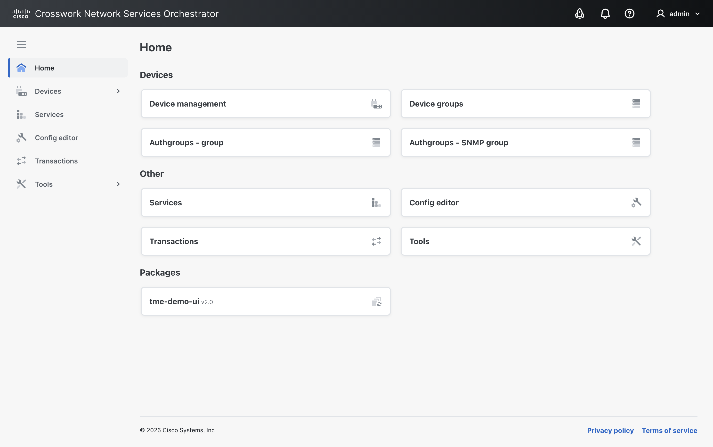

3. Click the *Device Management* shortcut to navigate to the *Device Management*
   view. Set the *Rows per page* dropdown to `50` so all devices are visible on
   a single page.

4. Click the *Settings* button on the right of the table header and unselect
   these columns:

   - Service instance(s)
   - Alarm

   Then select this column:

   - Platform name

   Close the *Select columns* panel.

   Scroll through the device list. Observe that these are netsim devices
   configured with a localhost address, each listening on a different port. NSO
   does not distinguish simulated devices and will use the configured protocol
   and port to connect to each device. Note the different device types shown in
   the platform column.

   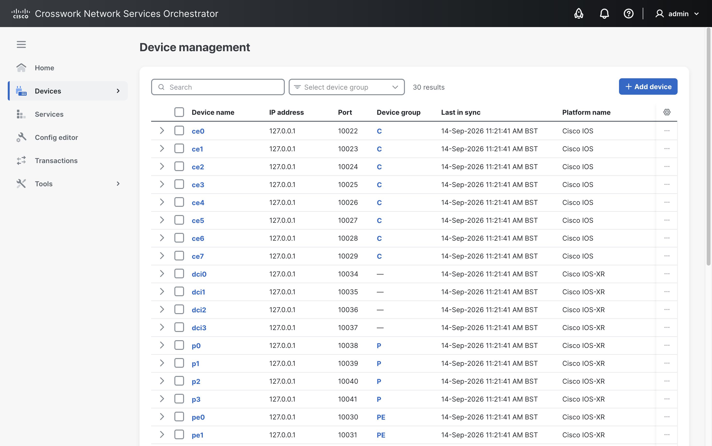

5. Select the checkbox in the table header to select all devices, and then from
   the *Choose actions* dropdown that appears, select *Sync from*. Observe that
   NSO synchronises the configuration from each device successfully.

6. Using the navigation sidebar on the left, select *Services* to navigate to
   the *Services* view. In the *Services* view, click the *Select service type*
   dropdown to show the three service types available:

   - Data Centre [`/connectivity:datacenter/connectivity`]
   - L3VPN [`l3vpn:vpn/l3vpn`]
   - Tenant [`tme-demo:tme-demo/tenant`]

7. Select the *Tenant* [`tme-demo:tme-demo/tenant`] service type to show the
   current tenant services:

   - ACME
   - Cyberdyne
   - STARK

8. Using the navigation sidebar on the left, select *Home* to return to the
   home screen.

## 2. Topology UI Overview

This section introduces the custom topology UI and shows how it presents normal
NSO data in a topology-oriented workflow.

From the NSO *Home* screen, open the topology UI from the *Packages* section by
clicking the `tme-demo-ui` shortcut.

### 2.1 Topology Viewer

1. Show the topology canvas and explain that the seeded demo topology is
   displayed. The topology gives the operator a visual context for the same
   devices and services that can also be managed from the standard NSO views.

   Point out the main domains: customer devices in the branch area, PE/P
   devices in the transport area, and switching/fabric devices in the
   data-centre area. The topology shows the relationships that the services use
   when calculating device configuration.

   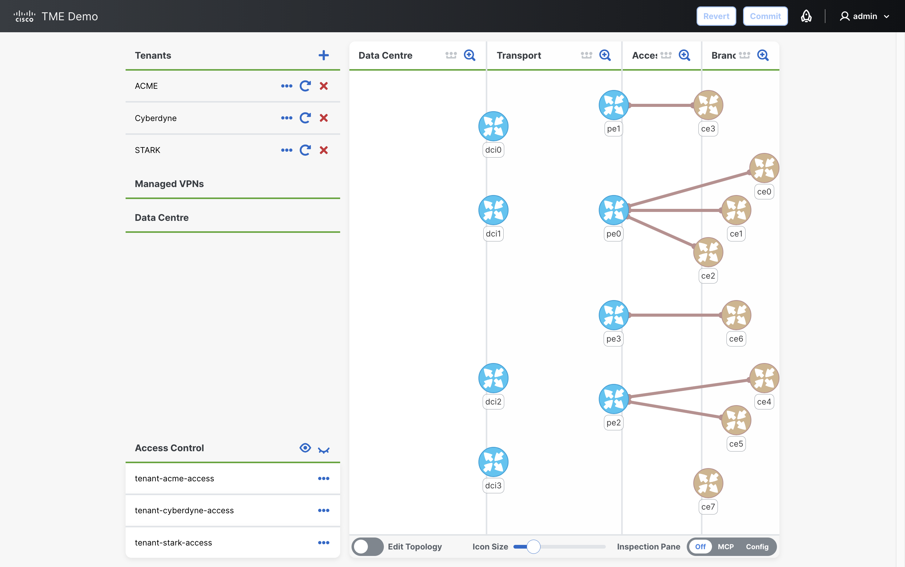

2. Use the *Icon Size* slider to set an icon size that works well for the demo
   screen. This is a useful first adjustment because the best icon size depends
   on the browser size and display resolution.

3. In the *Data Centre* and *Transport* topology domain headers, toggle underlay
   visibility using the *Show underlay devices* or *Hide underlay devices*
   button. Explain that underlay devices can be shown when extra topology
   context is useful, but hidden when the demo needs a simpler view. Also point
   out the device icon colours:

   - transport devices are blue router icons
   - customer devices are brown router icons
   - data-centre devices are green switch icons

   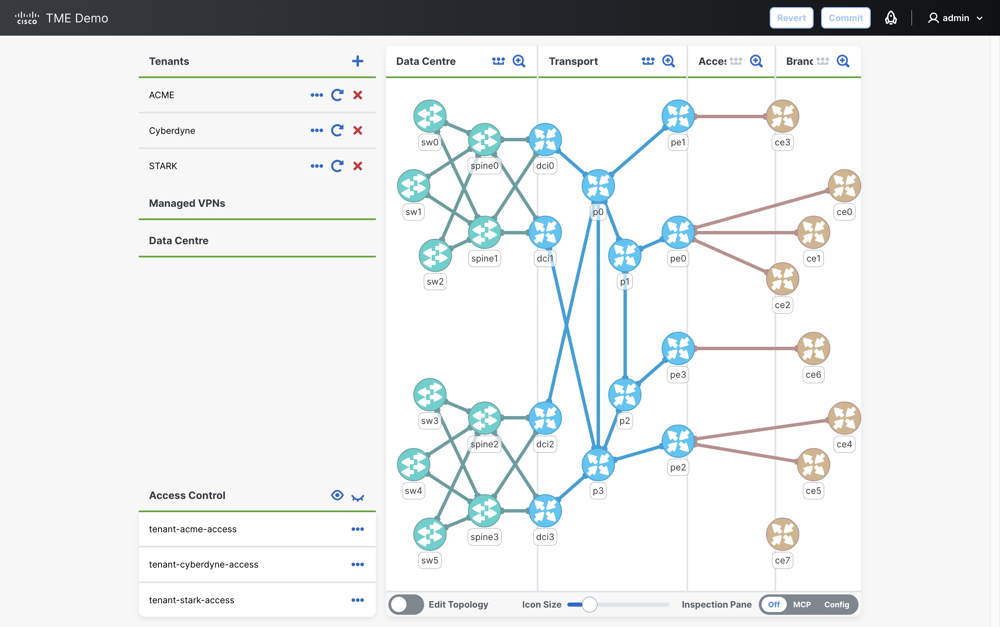

4. Hover over `pe0`, `pe3`, and `pe2` and note the different vendor
   platforms:

   - `pe0`: Cisco IOS-XR
   - `pe2`: Juniper Junos
   - `pe3`: Nokia TiMOS

   The tooltip also shows device status and platform version information from
   NSO.

### 2.2 Configuration Viewer

1. Locate the *Inspection Pane* control at the bottom of the screen and set it
   to *Config*. Select the three devices (`pe0`, `pe2`, and `pe3`) just
   shown in the *Topology Viewer* and observe that they appear in the *Config
   Viewer*.

2. Expand each device in the *Config Viewer* to display NSO's copy of the
   complete device configuration. Select each display format
   (`cli`, `curly-braces`, `json`, `xml`, and `yaml`). Before service changes
   are made, this is a useful baseline view; later in the demo, service-owned
   configuration will be highlighted and annotated here.

   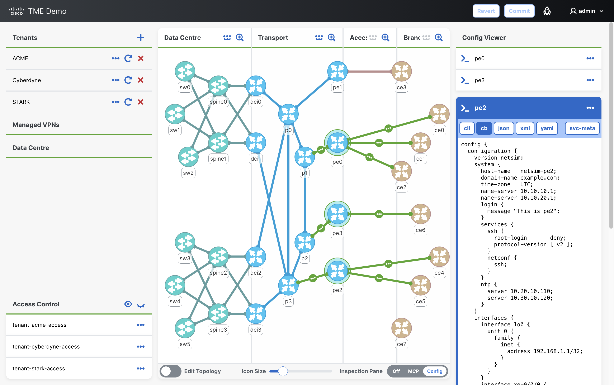

3. In the header of the `pe0` item in the *Config Viewer*, point out the
   buttons that can open the device in the *Configuration Editor* (useful for
   running device actions) or connect directly to the device console. Briefly
   click the *Connect to device console* button to the left of the name and
   observe the device terminal screen that appears. This is implemented as a
   direct SSH connection to the device, completely bypassing NSO. Click the same
   button again to disconnect from the console.

### 2.3 Tenant Sidebar

1. In the *Tenant* sidebar on the left, select the `ACME` tenant. Selecting a
   tenant switches the sidebar context for the *Managed VPNs* and *Data
   Centre* service views below, only showing the services for the selected
   tenant.

   For advanced audiences, explain that the tenant is a stacked service. The
   top-level `tme-demo:tenant` service provides a customer-focused input model,
   then creates and owns the lower-level `l3vpn` and `datacenter` services
   that generate device configuration.

2. Expand the `VPN ACME` item under the *Managed VPNs* section and then the
   `VLAN 501` item under the *Data Centre* section. Observe this
   tenant currently has no endpoints configured. Point out that the UI maps
   directly to the YANG model and uses NSO services underneath. Changes made
   here are still normal NSO transaction changes.


## 3. Access Control Overview

This section introduces the tenant access-control rules before showing how they
can be used to restrict visibility of other tenants for a tenant user.

1. In the *Tenant* sidebar, show that the current `admin` user can
   see the seeded tenants:

   - `ACME`
   - `Cyberdyne`
   - `STARK`

2. Expand the *Access Control* panel at the bottom of the *Tenant* sidebar and
   review the tenant NACM rule lists:

   - `tenant-acme-access`
   - `tenant-cyberdyne-access`
   - `tenant-stark-access`

   Explain that each tenant service has a corresponding NSO user configured, and
   that logging in as a tenant user will restrict access based on the tenant
   NACM rule lists displayed here. This panel is only visible when logged in as
   `admin`.

   Also explain the rule shape:

   - permit each tenant user's own service
   - deny access to other tenant services

   The demo supports two sets of access profiles: fully isolated
   tenants (the eye closed icon) and shared read access between tenants (the
   eye open icon).

   The demo currently has the fully isolated profile loaded. This can be shown
   by expanding the `deny-other-tenants` rules under the `tenant-acme-access`
   rule-list and observing the access operations (including read) that are
   denied by the rules.

   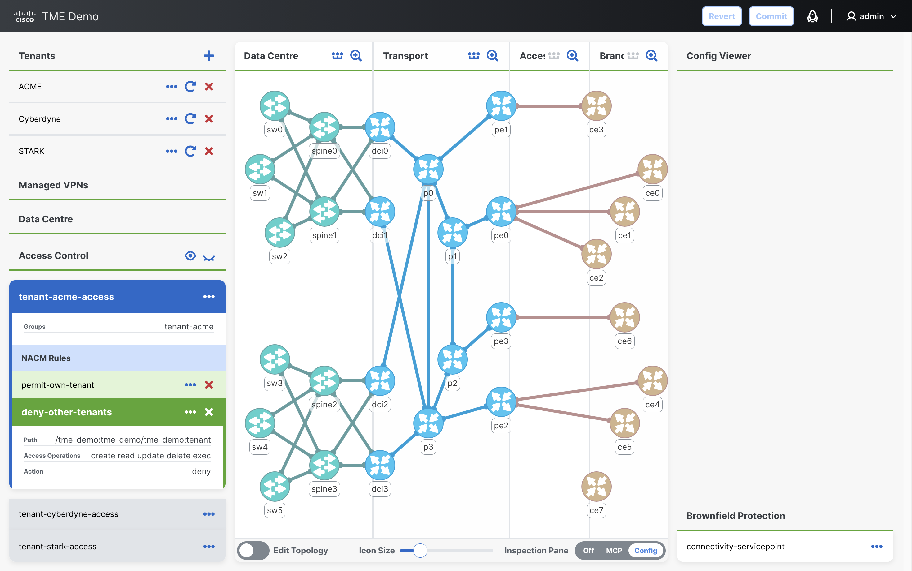

3. Log out of NSO using the *Log out* button in the
   user menu on the right of the header. Then log back in as the `acme` user
   (password: `acme`).

4. Open the topology UI from the
   `tme-demo-ui` shortcut in the *Packages* section on the NSO *Home* screen.
   Show that only `ACME` is visible/selectable in the *Tenant* sidebar.
   Explain that tenant isolation is enforced by NSO NACM. The UI only
   shows what the logged-in user is authorised to read.

   Continue the demo as the `acme` user.

## 4. MCP Explorer Overview

This section introduces the MCP Explorer and the capabilities currently
advertised by the NSO Adaptive MCP server.

The NSO Adaptive MCP server discovers the services, actions, devices, resources,
and prompts available in the running NSO system. For each service type loaded
into NSO, it exposes separate service tools, service action tools, service
resources, and service resource templates rather than a single generic service
interface. The exact capabilities advertised to clients are controlled by the
MCP policy rules.

The *MCP Explorer* visualises those advertised capabilities in two ways.
*Curated View* is the presenter-friendly view: it groups service tools and
resources by the service types used in this demo (`tenant`, `l3vpn`, and
`datacenter`), groups the default read, device, and system capabilities into
useful sections, and applies an additional UI-level filter so only
demo-relevant advertised items are shown. *Raw View* is closer to the MCP
server response and shows every advertised tool, resource, resource template,
and prompt without demo-specific grouping.

1. Set the right *Inspection Pane* to *MCP*. In the *MCP Explorer* header,
   observe that the MCP server is reachable, shown by the green status dot.
   Hover over the dot to display a summary of the currently advertised
   capabilities.

2. Select *Curated View* and browse the top-level sections. At this point the
   server is using the default `restricted` policy, which limits the advertised
   tools to the default read and device tools. This is why no *Service Tools* are
   currently displayed.

   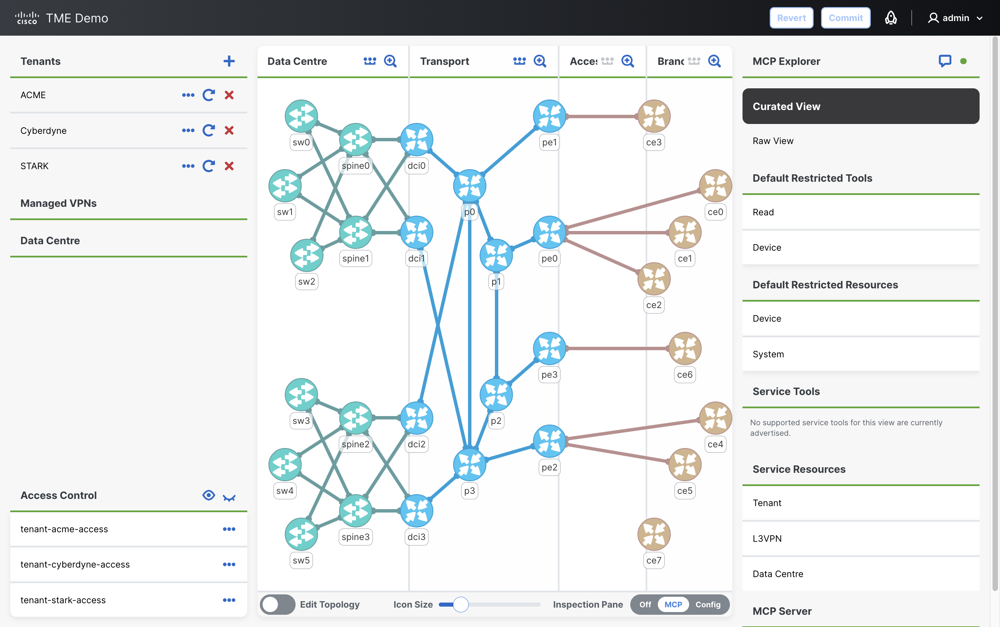

3. In the *MCP Server* section, expand the *Policies* item and observe that the
   default policy is `restricted` and no policy rules exist.

4. Select device `ce0`, expand *Default Restricted Tools > Device*, and run the
   *Ping* tool by clicking the `>` button. Observe that the ping is successfully
   executed by the MCP server.

5. Expand *Default Restricted Resources > Device* and read the *Config Only*
   resource by clicking the `>` button. Observe that the full device
   configuration is returned by the MCP server.

   After viewing the configuration, click the *Hide MCP Session* button.

6. Switch to *Raw View* and show the ungrouped MCP tools and resources
   advertised by the MCP server using the default restricted policy.

## 5. Out-of-Band Drift Detection

This section demonstrates how NSO detects and reconciles direct device changes
made outside NSO.

1. Select `ce0` in the topology and set the *Inspection Pane* to *Config*.

2. Click the *Connect to device console* button on the left side of the `ce0`
   item in the *Config Viewer*. This opens a direct device terminal (using SSH).
   Explain that this connection bypasses NSO, just like an engineer
   logging directly into the device.

3. In the *Terminal* window, press Enter to start the session. Observe that the
   terminal is connected to the device console, then enter enable mode and show
   the running configuration:

   ```text
   Press ENTER to start.

   ce0> enable
   ce0# show running-config
   ```

   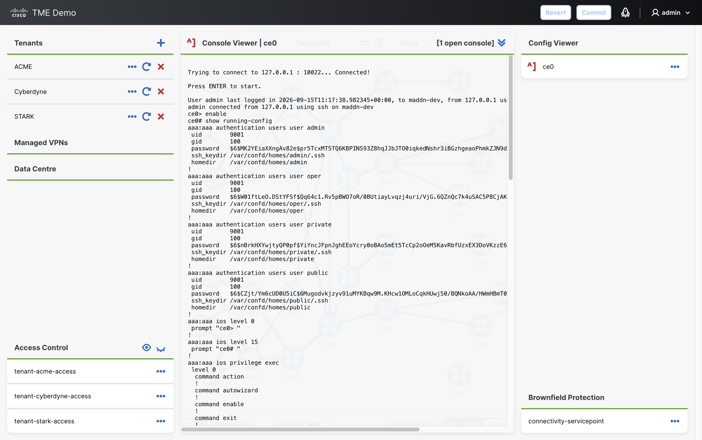

4. Enter configuration mode, make a small out-of-band change, and close the
   connection:

   ```text
   ce0# conf t
   Enter configuration commands, one per line. End with CNTL/Z.
   ce0(config)# snmp-server community public ro
   ce0(config)# end
   ce0# exit

   Connection closed.
   ```

   The device is now out of sync with NSO.

5. Click the *Disconnect from device console* button in the header to close the
   terminal window.

> **MCP option available:** steps 6-9 can be replaced by the MCP variant below.

6. Click the *View device in Configuration Editor* button on the right side of
   the `ce0` item in the *Config Viewer*.

7. In the *Configuration Editor*, use the *Actions* menu to run `check-sync`.
   Observe that NSO reports the device is out of sync.

8. From the *Actions* menu, run `compare-config`. Observe that the diff shows
   the exact configuration present on the device but not in NSO.

9. From the *Actions* menu, run `sync-from`. The device is now in sync. Press
   the browser back button to return to the topology UI.

> **MCP variant for steps 6-9:** Run the NSO device actions from
> the *MCP Explorer* instead of using the NSO *Configuration Editor* view.
>
> Use this block instead of steps 6-9 above, then continue with step 10.
>
> 1. Set the right *Inspection Pane* to *MCP* and ensure `ce0` is selected in
>    the topology.
> 2. In the *MCP Explorer*, expand *Default Restricted Tools > Device*.
> 3. Run `check-sync` by clicking the `>` button on the *Check Sync* item.
> 4. Run `compare-config` by clicking the `>` button on the *Compare
>    Config* item.
> 5. Run `sync-from` by clicking the `>` button on the *Sync From* item.
> 6. After observing the tool output, click the *Clear and Close MCP
>    Session* button in the header.

10. Set the *Inspection Pane* control to *Config*. If `ce0` is currently
   selected in the topology, unselect and then reselect it to refresh the
   configuration.

11. Expand the `ce0` item in the *Config Viewer* and observe that the
   additional configuration line now appears in NSO's copy of the device
   configuration.

## 6. Service Creation

This section demonstrates service intent being translated into device
configuration across multiple domains and vendors. The presenter only supplies
VPN endpoint intent; NSO uses the service model, topology data, and NEDs to
calculate the required CE and PE device changes.

### 6.1 VPN Endpoint Creation

1. With `ACME` selected in the *Tenant* sidebar, expand `VPN ACME` below the
   *Managed VPNs* section. VPN endpoints can be added by clicking the `+` icon,
   or by dragging a CE device from the topology onto the *VPN Endpoints* section
   in the sidebar.

2. Drag the `ce1` device icon from the topology to the *VPN Endpoints* section
   in the sidebar. Enter the endpoint name `Madrid` in the pop-up field and
   click the `>` button.

   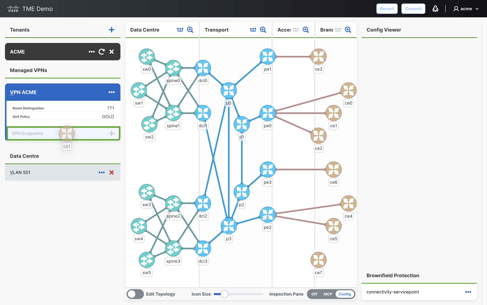

   The newly created VPN endpoint is displayed in the NSO
   *Configuration Editor*. Set `ce-interface` to `0/1`. The other fields can be
   updated or left as default.

   Optionally demonstrate YANG validation by entering an invalid value in
   `as-number`, such as `70000`. NSO rejects the value because the service model
   restricts the field to the range `0..65535`. This range is defined in the
   `tme-demo` service YANG model.

   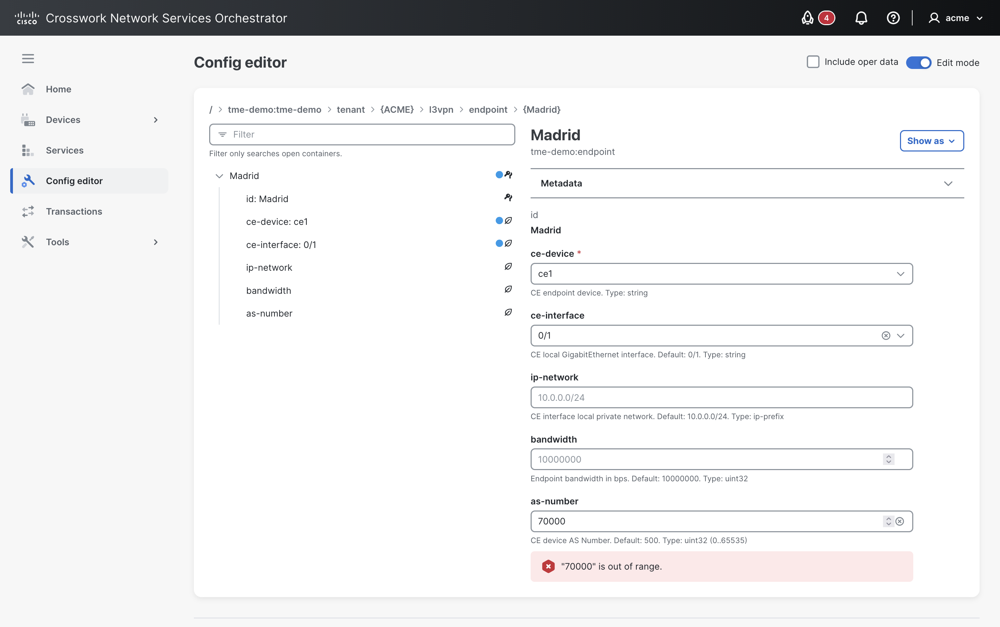

   Restore the default value before continuing by pressing the small `x` icon on
   the right side of the textbox.

   Point out that the selected CE device is prepopulated from the drag
   operation, while the service supplies defaults for the other endpoint inputs.

   - endpoint name: `Madrid`
   - device: `ce1`
   - interface: `0/1`

   Press the browser back button to return to the topology UI.

3. Drag the `ce4` device icon from the topology to the *VPN Endpoints* section
   in the sidebar. Enter the endpoint name `Berlin` in the pop-up field and
   click the `>` button. In the NSO *Configuration Editor*, set `ce-interface`
   to `0/1` and set `ip-network` to a different value from the first endpoint,
   for example `10.0.4.0/24`. Press the browser back button to return to the
   topology UI.

   - endpoint name: `Berlin`
   - device: `ce4`
   - interface: `0/1`
   - IP network: `10.0.4.0/24`

### 6.2 Transaction Review and Commit

> **Presenter note:** This dry-run review pattern is used again for later
> service updates and service actions.

1. Open the NSO *Transactions* view using the rocket icon in the header. Observe
   the pending service model changes in the transaction. These are the requested
   service intent changes, not the final device commands.

2. Click the *Validate* button followed by the *Commit* button. This opens the
   *Commit changes* drawer on the right.

3. Expand the *Commit settings* section and select the *dry-run* option. Expand
   the *dry-run* section, set *outformat* to `cli`, and click the
   *Commit (Dry-run)* button. Explain that this shows the pending device model
   changes in NSO's CDB format. NSO has taken the service intent and calculated
   the configuration changes required on each affected device.

   Scroll to the bottom of the output to show the tenant and L3VPN service
   model changes. The tenant changes are the compact service inputs entered by
   the operator. The tenant service uses two lower-level services, `l3vpn` and
   `datacenter`, to generate the required device configuration. The dry-run
   shows the `vpn` service that will be created with the full set of inputs for
   each endpoint.

   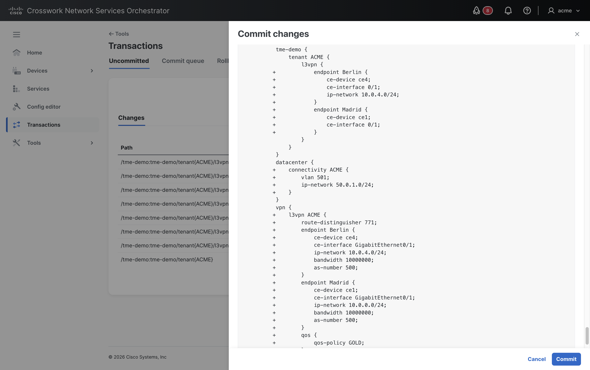

   > **Presenter note:** In the first commit, the `datacenter` service is also
   > created and can be seen in the dry-run output. This can be ignored; at this
   > point there are no data-centre endpoints so no device configuration is
   > generated.

   Scroll above those entries to show the generated device model changes on the
   CE and PE devices for the two VPN endpoints.

4. Expand the *Commit settings* section again. Select *dry-run*, set *outformat*
   to `native`, and click the *Commit (Dry-run)* button. Explain that this
   shows the native configuration that NSO will send to the devices. The `cli`
   dry-run was NSO's device model representation, whereas the `native` dry-run
   is rendered through the device NEDs into the syntax each device understands.

   For this transaction, NSO configures both CE devices and their connected PE
   devices. For example, `ce1` is connected through `pe0` and `ce4` is connected
   through `pe2`, so the output includes both customer-edge and provider-edge
   changes. The native output also shows different device interfaces: Cisco
   IOS-XR devices receive CLI-style payloads, while the Juniper device receives
   NETCONF XML. The dry-run gives the operator a chance to inspect those changes
   before they are sent.

5. Click the *Commit* button. NSO sends the changes to the affected devices.
   If a device update fails, NSO attempts to roll back changes already made to
   other devices in the same transaction.

### 6.3 Configuration Ownership

This section shows that NSO stores the intended device configuration in CDB and
tracks which service owns each generated configuration node.

1. Press the browser back button to return to the topology UI. Observe that the
   endpoint CE devices and connected PE devices are highlighted because they
   now have configuration that is owned by the currently selected `ACME` tenant
   service. If the expected highlights are not visible, refresh the browser
   window and make sure `ACME` is still selected in the *Tenant* sidebar.

2. Set the right *Inspection Pane* to *Config* and select `ce1` in the
   topology. Expand the `ce1` item in the *Config Viewer* and scroll through
   the configuration. Explain that the *Config Viewer* displays NSO's copy of
   the device configuration from the CDB, not live output read directly from the
   device. The part of the configuration generated and owned by the service is
   highlighted in blue.

   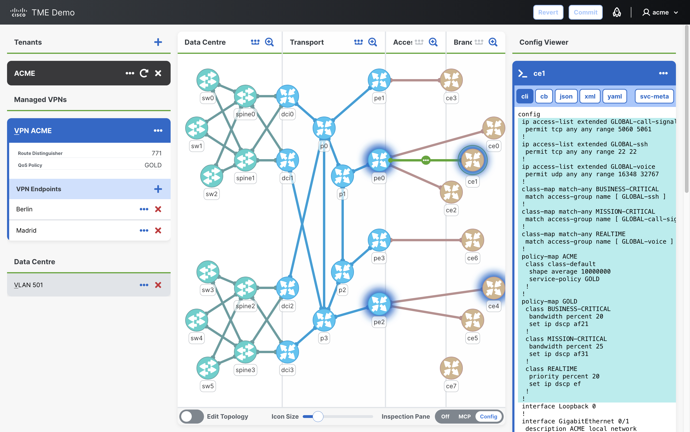

3. Click the `svc-meta` button to display the service metadata annotations.
   The `backpointer` metadata identifies the service instance associated with the
   configuration. The `refcount` metadata prevents NSO from removing shared
   configuration; NSO only removes configuration that it fully owns and is no
   longer referenced by any service.

## 7. MCP Service Operations

This section demonstrates an LLM assistant using the service tools advertised
by the MCP server.

### 7.1 MCP Server Policies

1. Set the right *Inspection Pane* to *MCP*. The MCP server is currently in
   restricted mode. It advertises service resources, but not service tools.
   Expand *Service Resources > Tenant* and read the *Config* resource by
   clicking the `>` button. Observe that the tenant resource returned by the MCP
   server includes the endpoints added in the previous step.

2. In *MCP Server > Policies*, click the *Reset Rules* button. This loads three
   policy rules that allow the MCP server to advertise service tools for the
   three service types used in the demo. Click the *Commit* button in the
   header to commit the transaction. Explain that MCP capability queries refresh
   automatically after commit, and note the extra items that now appear in the
   *Service Tools* section. Expand the *Tenant* group to show some of the
   additional tools that are now advertised.

3. Switch to *Raw View* and expand the *Tools* item to show the full list of
   ungrouped service tools now advertised. Expand the `l3vpn_vpn_l3vpn_create`
   tool to show the generated input schema. Return to *Curated View* before
   continuing.

### 7.2 Assistant Service Operations

1. Click the *Clear MCP Session* button in the *MCP Session* header to display
   the suggested messages. If the *MCP Session* viewer is not visible, click
   the chat icon in the *MCP Explorer* header first; it opens the same viewer
   without running an MCP item.

2. Use the first five suggested messages to show how a typical assistant can
   use the MCP resources and tools advertised by the MCP server.

   For each message, select the suggested message and press Enter.

   > **Presenter note:** The assistant uses small LLMs running locally and may
   > take time to generate responses. These models also have limited reasoning
   > ability and may not generate the expected response.

   - **Which tenant am I working on?**<br/>
     Demonstrates the prerequisite context check that the assistant is aware of
     the current UI selection.

   - **What L3VPN endpoints are configured for this tenant?**<br/>
     Demonstrates an assistant reading the included MCP resource.

   - **Check all VPN endpoint devices are in sync**<br/>
     Demonstrates an assistant calling the appropriate MCP tool based on the
     included resource data.

   - **Add a VPN endpoint called London using ce2 interface 0/1**<br/>
     Demonstrates an assistant making an update to an NSO service using an
     advertised MCP service tool.

   - **Add a VPN endpoint called Paris using ce3 interface 0/1 with 20 Mbps
     bandwidth and choose any IP network**<br/>
     Demonstrates a more in-depth service update using the advertised tool
     schema to generate the tool payload.

   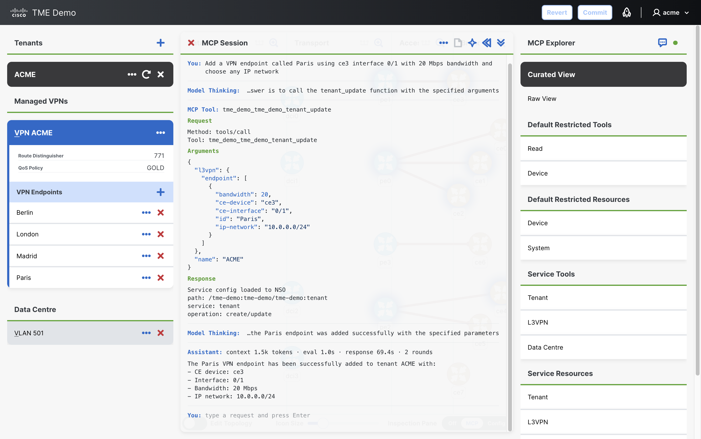

## 8. Service Modification

This section shows how an existing service can be changed after deployment. The
operator updates the service intent, and NSO recalculates the minimum device
configuration changes needed to keep the deployed service aligned with that
intent.

> **MCP option available:** steps 1-4 can be replaced by the MCP preview variant
> below. This demonstrates the assistant-generated service update and dry-run
> output, but does not commit the bandwidth change.

1. With `ACME` selected in the *Tenant* sidebar, expand `VPN ACME` below the
   *Managed VPNs* section. Click the *View VPN Endpoint in Configuration
   Editor* button on the `Madrid` endpoint.

2. In the *Configuration Editor*, select the *Edit mode* toggle and change the
   `bandwidth` from the default `10000000` bps to `20000000` bps (20 Mbps).

3. In the *Configuration Editor*, click the *Transactions* shortcut in the
   sidebar and note the old and new service input values in the changes list.
   Use the same dry-run review pattern from
   [section 6.2](#62-transaction-review-and-commit) to compare the small
   `bandwidth` change with the generated device model changes. Point out that
   NSO has calculated the minimal changes required to update the bandwidth,
   rather than rewriting the whole service configuration.

4. Commit the transaction using the *Commit* button at the bottom of the
   *Commit changes* drawer. Press the browser back button to return to the
   topology UI.

> **MCP variant for steps 1-4:** Use the assistant to preview the bandwidth
> update.
>
> Use this block instead of steps 1-4 above. Continue with step 5 if showing the
> optional QoS policy update.
>
> 1. In the *MCP Session* viewer, click the *Clear MCP Session* button in the
>    header to show the suggested messages. If the viewer is not visible, click
>    the chat icon in the *MCP Explorer* header first.
>
> 2. Select the bandwidth preview suggested message and press Enter:
>
>    - Update the bandwidth for all VPN endpoints to 20 Mbps and preview the
>      changes
>
>    Observe the MCP service update request payload, including the dry-run
>    parameter, and the MCP response showing the minimal diff that would be
>    applied to the device model. Click the *Clear and Close MCP Session*
>    button after reviewing the output.

5. Optionally, update the tenant QoS policy to show a change that affects all
   endpoints. Click the *View Tenant in Configuration Editor* button on the
   `ACME` tenant and change `l3vpn/qos-policy` from `GOLD` to `SILVER`. This
   tenant-level service input shows a broader service recalculation than the
   single endpoint bandwidth change.

   Click the *Transactions* shortcut in the sidebar and note the old and new
   values in the changes list. Use the same dry-run review pattern from
   [section 6.2](#62-transaction-review-and-commit) and point out that NSO has
   calculated the minimal changes required across all affected VPN devices.

6. Commit the transaction using the *Commit* button at the bottom of the
   *Commit changes* drawer. Press the browser back button to return to the
   topology UI.

## 9. Service Repair

This section demonstrates repairing a deployed service after the physical
topology changes. The service intent remains unchanged, but NSO uses the
updated topology data to recalculate where the service configuration should be
deployed.

1. State that a (fictional) problem has been reported with the link between
   `ce4` and `pe2`, and `ce4` is re-homed to `pe3`. The topology information in
   NSO needs updating to reflect that `ce4` is now connected to `pe3`. Select
   the *Edit Topology* toggle in the topology footer.

2. Move the CE link for the `Berlin` endpoint by dragging the `ce4` connection
   from `pe2` to `pe3`, and commit the topology change using
   the *Commit* button in the header. The topology information in the CDB has
   now been updated, but the deployed VPN service has not yet been repaired.
   Select the *Edit Topology* toggle again to leave edit mode.

   Explain that the service intent still says `Berlin` is on `ce4`, but the
   topology now says `ce4` is attached to a different PE. At this point, the
   service is no longer operational because the old PE still has configuration
   that should now be on the new PE. The L3VPN service uses NSO topology data
   to determine which PE is connected to each CE, so changing the `ce4` link
   changes what NSO calculates during redeploy.

> **MCP option available:** steps 3-8 can be replaced by the MCP variant below.

3. The service can be repaired automatically using NSO's redeploy feature.
   Click the *View Tenant in Configuration Editor* button on the `ACME` tenant.

4. In the *Configuration Editor*, open the *Actions* menu and select
   `re-deploy`.

5. Select the *dry-run* option, expand the *dry-run* section, and set
   *outformat* to `cli`.

6. Click the *Run* button. NSO uses the original service intent and
   recalculates what device configuration is required against the updated
   topology. Scroll through the device model dry-run output and point out the
   minimum diff: a small CE change and the larger PE migration. NSO removes
   service config from the old PE and adds the required config on the new PE.

7. Change the *outformat* to `native` and click the *Run* button again.
   Observe that the output shows the actual commands that will be sent to the
   devices to repair the service. Observe that `pe3` is Nokia ALU-SR CLI and
   `pe2` is Juniper NETCONF XML, so NSO is performing an automatic cross-vendor
   migration to do this repair.

8. Unselect the *dry-run* option, and click *Run* again to send the changes to
   the devices. Once the transaction completes, press the browser back button to
   return to the topology UI.

> **MCP variant for steps 3-8:** Run the redeploy operations from
> the *MCP Explorer*.
>
> Use this block instead of steps 3-8 above.
>
> 1. Ensure `ACME` is selected in the *Tenant* sidebar, then set the right
>    *Inspection Pane* to *MCP*.
> 2. In the *MCP Explorer*, expand *Service Tools > Tenant*, and then expand the
>    *Redeploy* item.
> 3. Select *Dry Run*, set *outformat* to `cli`, and click the `>` button on
>    the *Redeploy* item. Observe the dry-run result in the *MCP Session*
>    viewer and make the same observations as stated in step 6 above.
> 4. Change *outformat* to `native` and click the `>` button on the *Redeploy*
>    item again. Observe the native dry-run output and make the same
>    observations as stated in step 7 above.
> 5. Unselect *Dry Run* and click the `>` button on the *Redeploy* item again
>    to send the changes to the devices.
> 6. Once the redeploy has completed, click the *Clear and Close MCP Session*
>    button.

## 10. NACM Enforcement with MCP

This section shows the same NACM rules introduced in section 3 being enforced
when executing MCP tools.

### 10.1 NACM Visibility

The assistant in the *MCP Session* viewer provides a convenient way to attempt
to access a restricted tenant which is not currently visible in the topology UI
(since the UI is also subject to the current NACM rules).

1. If not already logged in as `acme`, log out and log back in as the `acme`
   user.

2. Confirm that the fully isolated tenant access profile is currently loaded
   and that the current `acme` user does not have visibility of other tenants.

   Set the right *Inspection Pane* to *MCP*, and click the chat icon in the
   *MCP Explorer* header.

3. Unselect `ACME` in the *Tenant* sidebar, and then select the *Redeploy
   tenant STARK* message in the *MCP Session* window and press Enter.

   Observe the output. The request shows the tool call contains the correct
   tenant name, `STARK`. The response correctly states that the tenant does not
   exist from the `acme` user's authorised view. The `acme` tenant has no
   visibility of the `STARK` tenant.

   This demonstrates that the MCP server enforces the NSO NACM rules.
   Any agents using MCP will still be subject to access control restrictions
   and do not bypass authorisation.

### 10.2 Enable Tenant Shared Read Access

1. Log out and log back in as the `admin` user. Open the topology UI from the
   `tme-demo-ui` shortcut in the *Packages* section on the NSO *Home* screen.

2. In the *Access Control* panel at the bottom of the *Tenant* sidebar, click
   the eye-open *Load Shared Read Access Rule List* button. Click the
   *Commit* button in the header to commit the transaction.

3. Log out and log back in as `acme`. Open the topology UI from the
   `tme-demo-ui` shortcut in the *Packages* section on the NSO *Home* screen.
   Note that all of the tenants are now visible to the `acme` user.

### 10.3 NACM Access Denial

1. Select the `STARK` tenant service in the *Tenant* sidebar.
2. Set the right *Inspection Pane* to *MCP*.
3. In the *MCP Explorer*, expand *Service Tools > Tenant*.
4. Run the *Redeploy* tool by clicking the `>` button. Observe the access
   denied response message. This confirms that the `acme` user has permission
   to view the other tenants, but no permission to make changes. This
   demonstrates the difference between read access and write/action access.

## 11. Shared Configuration Ownership

This section demonstrates the data-centre connectivity service. The service
uses the tenant VLAN to connect compute-facing switch ports and extend that
VLAN through the data-centre fabric.

### 11.1 First Data Centre Endpoint

1. With `ACME` selected in the *Tenant* sidebar, expand `VLAN 501` below the
   *Data Centre* section. Data-centre endpoints are added by dragging a switch
   from the topology onto the *Data Centre Endpoints* section in the sidebar.

2. If no switch devices are visible on the topology in the *Data Centre* domain,
   click the *Show underlay devices* button in the domain header. Click the
   *Zoom in* button in the *Data Centre* domain header to focus on the switch
   devices.

3. Drag the `sw0` device icon from the topology onto the *Data Centre
   Endpoints* section. The newly created data-centre endpoint is displayed in
   the NSO *Configuration Editor*. Set `ios-GigabitEthernet` to `0/1`. Press
   the browser back button to return to the topology UI.

   - device: `sw0`
   - compute: automatically generated (compute0)
   - interface: `0/1`

4. Open the NSO *Transactions* view using the rocket icon in the header. Run a
   `native` dry-run using the same pattern from
   [section 6.2](#62-transaction-review-and-commit). Point out that NSO has
   generated access-port configuration for `sw0` and fabric configuration for
   `spine0` and `spine1`. The service uses the data-centre topology to determine
   that `sw0` is in *Data Centre 1* and connects through those spine devices.

5. Click the *Commit* button to commit the data-centre endpoint. After the
   commit completes, press the browser back button to return to the topology UI.

### 11.2 Second Data Centre Endpoint

1. With `ACME` selected in the *Tenant* sidebar, expand `VLAN 501` below the
   *Data Centre* section.

2. Drag the `sw1` device icon from the topology onto the *Data Centre
   Endpoints* section. The newly created data-centre endpoint is displayed in
   the NSO *Configuration Editor*. Set `ios-GigabitEthernet` to `0/1`. Press
   the browser back button to return to the topology UI.

   - device: `sw1`
   - compute: automatically generated (compute0)
   - interface: `0/1`

3. Open the NSO *Transactions* view and run a `native` dry-run. Point out that
   the config is smaller than the first endpoint because the shared `VLAN 501`
   fabric configuration already exists on `spine0` and `spine1`. NSO only adds
   the newly required access-port configuration for `sw1`, while service
   metadata tracks the shared fabric configuration references.

4. Click the *Commit* button to commit the second data-centre endpoint. After
   the commit completes, press the browser back button to return to the
   topology UI.

5. Set the right *Inspection Pane* to *Config* and select `sw0`, `sw1`,
   `spine0`, and `spine1` in the topology. Expand the devices in the
   *Config Viewer* and scroll through the configuration. The configuration
   generated and owned by the data-centre service is highlighted in blue.

   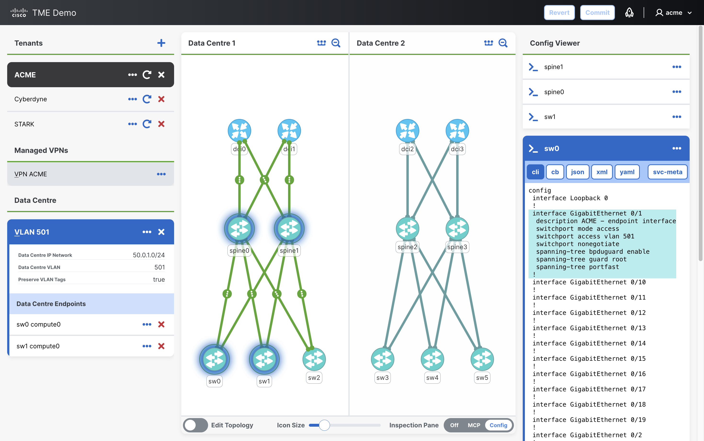

   Click the `svc-meta` button to display the service metadata annotations.

   Highlight the `sw0` and `sw1` access-port VLAN configuration, and
   optionally the trunk and spine fabric configuration. Point out that NSO is
   provisioning a consistent `VLAN 501`, which the brownfield policy will
   protect later.

### 11.3 First Endpoint Removal

1. With `ACME` selected in the *Tenant* sidebar, expand `VLAN 501` below the
   *Data Centre* section. Click the *Delete Data Centre Endpoint* button on the
   `sw0 compute0` item.

2. Open the NSO *Transactions* view using the rocket icon in the header. Run a
   `native` dry-run using the same pattern from
   [section 6.2](#62-transaction-review-and-commit).

   Observe that NSO removes the access-port configuration from `sw0`, but keeps
   the shared fabric configuration on `spine0` and `spine1` (which was
   initially created for the `sw0` endpoint) because it is still required by
   the remaining `sw1` endpoint.

3. Click the *Commit* button to commit the endpoint removal. After the commit
   completes, press the browser back button to return to the topology UI.

4. Set the right *Inspection Pane* to *Config* and select `sw1`, `spine0`, and
   `spine1` in the topology. Expand the devices in the *Config Viewer* and
   observe that the `sw1` access-port configuration and shared fabric
   configuration are still present.

### 11.4 Optional Remote Data Centre

1. With `ACME` selected in the *Tenant* sidebar, expand `VLAN 501` below the
   *Data Centre* section.

2. Drag the `sw5` device icon from the topology onto the *Data Centre
   Endpoints* section. The newly created data-centre endpoint is displayed in
   the NSO *Configuration Editor*. Set `f10-GigabitEthernet` to `0/10`. Press
   the browser back button to return to the topology UI.

   - device: `sw5`
   - compute: automatically generated (compute0)
   - interface: `0/10`

3. Open the NSO *Transactions* view and run a `native` dry-run. Point out that
   NSO now extends the same tenant VLAN into the second data centre. As well as
   the access configuration on `sw5` and fabric configuration on the two spines
   (`spine2` and `spine3`) in *Data Centre 2*, NSO also configures all four DCI
   devices (`dci0`, `dci1`, `dci2` and `dci3`) to connect the VLAN between data
   centres.

> **Presenter note:** If this change is committed, the later brownfield
> dry-run also includes additional `spine2` and `spine3` changes when the
> data-centre `ip-network` is updated.

4. Click the *Commit* button to commit the remote data-centre endpoint. After
   the commit completes, press the browser back button to return to the
   topology UI.

## 12. Brownfield Protection Flow

This section demonstrates NSO out-of-band interoperation using brownfield
policies and `confirm-network-state`. Using `confirm-network-state` allows NSO
to detect and classify direct device-side changes during normal service
updates, so brownfield policies can automatically adopt approved additions or
restore service-owned intent.

This section assumes the data-centre service from section 11 has been created.
At minimum, `sw1` should be present under `VLAN 501`.

### 12.1 Brownfield Policies

1. In the topology UI, select the `ACME` tenant and set the right
   *Inspection Pane* to *Config*.

2. Expand the *Brownfield Protection* panel at the bottom of the *Config
   Viewer*. Expand the `connectivity-servicepoint` policy and review the ordered
   rules:

   - `restore-service-leaves` uses `sync-to-device` for service-owned leaves
   - `adopt-service-subtree-leaves` uses `manage-by-service` for changes to
     leaves added below a service-owned access interface
   - `sync-unmanaged-leaves` uses `sync-from-device` for detected unmanaged
     interface leaves inside the out-of-band processing scope

   Point out that `confirm-network-state` is not enabled globally for the whole
   demo environment. It will be manually set during the later commit operations.
   Also point out that service-owned conflicts are restored before approved
   additions are adopted.

### 12.2 Direct Device Changes

1. Set the right *Inspection Pane* to *Config* and select `sw1` in the topology.
   Click the *Connect to device console* button on the left side of the `sw1`
   item in the *Config Viewer*. This opens a direct SSH session to the switch
   and bypasses NSO.

2. In the *Terminal* window, press Enter to start the session and enter enable
   mode:

   ```text
   Press ENTER to start.

   sw1> enable
   sw1#
   ```

3. Apply the two out-of-band changes below as separate story beats. Do not run
   `sync-from` after making the changes. The point is that the next normal NSO
   service update should discover and handle the drift.

#### 12.2.1 Change 1: Adopt Extra Config in a Service-owned Subtree

> **Scenario:** The NSO operations user receives a ticket saying the compute
> attached to `sw1` needs a special MTU. The current service model does not
> expose MTU as an input, so the operator applies the small manual change
> directly on the service-owned access port.

- Explain the scenario above, then paste the following CLI in the `sw1` terminal
  to add `mtu 1520` to `GigabitEthernet 0/1`:

  ```text
  conf t
  interface GigabitEthernet 0/1
   mtu 1520
  end
  ```

  **Later policy match:** `manage-by-service`.

  **Later policy outcome:** the MTU is kept, stored in service metadata as extra
  out-of-band service data, and removed later when the service is removed.

#### 12.2.2 Change 2: Protect Service-owned Intent

> **Scenario:** A network engineer is planning to provision a new unrelated
> service on `sw1` `GigabitEthernet 0/11`. When configuring the
> interface VLAN, they accidentally enter `GigabitEthernet 0/1`, which is
> already owned by the data-centre service.

- Explain the scenario above, then paste the following CLI in the `sw1` terminal
  to change the service-owned access VLAN on `GigabitEthernet 0/1` to an
  incorrect value:

  ```text
  conf t
  interface GigabitEthernet 0/1
   switchport access vlan 999
  end
  ```

  **Later policy match:** `sync-to-device`.

  **Later policy outcome:** NSO rejects the device-side VLAN and restores the
  service-intended value during the normal service transaction.

After applying the two changes, exit the terminal session:

```text
sw1# exit

Connection closed.
```

### 12.3 NSO Service Modification

The device has drifted behind NSO's back, and the service operator is unaware
of it because no `sync-from` has been run. Without `confirm-network-state`, the
next service update would fail because the device is out of sync.

Modify the service by updating `ip-network` with the `confirm-network-state`
commit flag.

1. With `ACME` selected in the *Tenant* sidebar, expand `VLAN 501` below the
   *Data Centre* section. Click the *View Data Centre VLAN in Configuration
   Editor* button on the `VLAN 501` item.

2. In the *Configuration Editor*, select the *Edit mode* toggle and change
   `ip-network` from `50.0.1.0/24` to `50.0.10.0/24`.

3. Click the *Transactions* shortcut in the sidebar and review the pending
   change. This is a normal service intent update; the direct device edits have
   not been manually synced into NSO.

4. Click the *Validate* button followed by the *Commit* button. This opens the
   *Commit changes* drawer on the right.

5. Expand the *Commit settings* section and select the *confirm-network-state*
   and *dry-run* options. Expand the *dry-run* section, set
   *outformat* to `cli`, and click the *Commit (Dry-run)* button.

   In the dry-run output, review two areas.

   First, in the main `data` section, point out the device-model changes:

   - The spine devices VLAN interface addresses are updated for the new
     `ip-network`.
   - `sw1` shows `mtu 1520` being added to NSO's copy of the device
     configuration

   Then scroll to the `confirm-network-state` section for `sw1` and point out:

   - `out-of-band` shows what NSO discovered on the device: the VLAN was changed
     from `501` to `999`, and `mtu 1520` was added
   - `data` shows what NSO will push back to the device: the VLAN is restored
     from `999` to the service-intended value `501`

   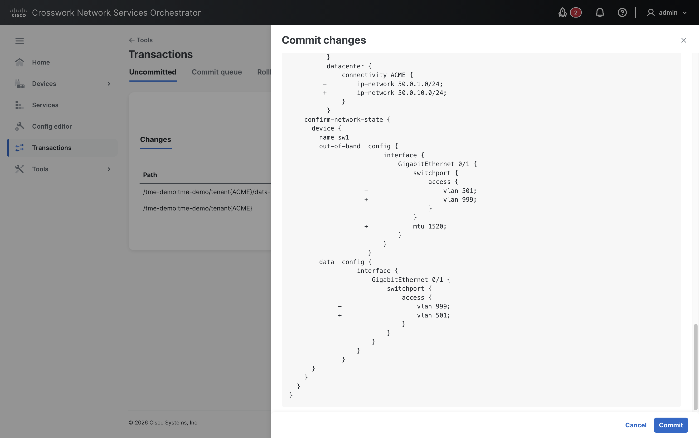

   This demonstrates both brownfield behaviours in one normal service
   transaction: the MTU is adopted into service-owned data, while the incorrect
   VLAN is repaired.

   > **Presenter note:** The NSO UI clears commit flags after each dry-run.
   > Before committing, scroll back up and select *confirm-network-state* again.

6. In the same *Commit changes* drawer, select *confirm-network-state* again and
   then click the *Commit* button to commit the service update.

7. After the commit completes, press the browser back button to return to the
   topology UI.

8. Set the right *Inspection Pane* to *Config* and select `sw1` in the topology.
   Expand the `sw1` item in the *Config Viewer*.

9. Inspect `GigabitEthernet 0/1` and point out that the access VLAN remains as
   the service-intended value. The manually added `mtu 1520` is now present
   and is annotated as out-of-band service data owned by the data-centre
   service.

### 12.4 Service Deletion

1. With `ACME` selected in the *Tenant* sidebar, expand the `VLAN 501` item
   under the *Data Centre* section. Click the *Delete Data Centre VLAN* button
   on the `VLAN 501` item.

2. Open the NSO *Transactions* view using the rocket icon in the header. Review
   the pending deletion and run a dry-run using the same pattern from
   [section 6.2](#62-transaction-review-and-commit).

   Point out that the data-centre service configuration will be removed from the
   affected devices including the MTU that was originally provisioned outside
   of NSO.

3. Click the *Commit* button to commit the data-centre service deletion.

4. After the commit completes, return to the topology UI, select `sw1`, and
   inspect `GigabitEthernet 0/1` in the *Config Viewer*. The adopted `mtu 1520`
   has been removed with the data-centre service configuration.
